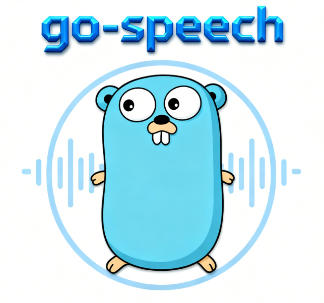

<div align="center" style="text-align: center;">
  
</div>

<p align="center">
   <a href="https://github.com/getcharzp/go-speech/fork" target="blank">
      
   </a>
   <a href="https://github.com/getcharzp/go-speech/stargazers" target="blank">
      
   </a>
   <a href="https://github.com/getcharzp/go-speech/pulls" target="blank">
      
   </a>
</p>

go-speech 基于 Golang + [ONNX](https://github.com/microsoft/onnxruntime/releases/tag/v1.23.2) 构建的轻量语音库，支持 TTS（文本转语音）与 ASR（语音转文字）。 集成 MeloTTS 、达摩院 Paraformer 架构模型、Whisper 模型。

## 安装

```shell
# 下载包
go get -u github.com/getcharzp/go-speech

# 下载模型、动态链接库
git clone https://huggingface.co/getcharzp/go-speech
```

## 快速开始

### TTS

```go
package main

import (
	"github.com/getcharzp/go-speech/tts/melotts"
	"github.com/up-zero/gotool/fileutil"
	"log"
)

func main() {
	ttsEngine, err := melotts.NewEngine(melotts.DefaultConfig())
	if err != nil {
		log.Fatalf("创建引擎失败: %v", err)
	}
	defer ttsEngine.Destroy()

	text := "2019年12月30日，中国人口突破14亿人,联系电话: 13800138000。"
	wavData, err := ttsEngine.SynthesizeToWav(text, 1.0)
	if err != nil {
		log.Fatalf("合成失败: %v", err)
	}

	outputPath := "output.wav"
	err = fileutil.FileSave(outputPath, wavData)
	if err != nil {
		log.Fatalf("保存 WAV 失败: %v", err)
	}
}
```

<audio controls>
  <source src="https://media.githubusercontent.com/media/GetcharZp/go-speech/master/assets/output.wav" type="audio/wav">
</audio>

### ASR

#### Paraformer

```go
package main

import (
	"fmt"
	"github.com/getcharzp/go-speech/asr/paraformer"
	"log"
)

func main() {
	asrEngine, err := paraformer.NewEngine(paraformer.DefaultConfig())
	if err != nil {
		log.Fatalf("创建引擎失败: %v", err)
	}
	defer asrEngine.Destroy()

	text, err := asrEngine.TranscribeFile("./zh-en.wav")
	if err != nil {
		log.Printf("识别出错: %v", err)
		return
	}
	fmt.Printf("识别结果: %s\n", text)
}
```

#### Whisper

```go
package main

import (
	"fmt"
	"github.com/getcharzp/go-speech/asr/whisper"
	"log"
)

func main() {
	asrEngine, err := whisper.NewEngine(whisper.DefaultConfig())
	if err != nil {
		log.Fatalf("创建引擎失败: %v", err)
	}
	defer asrEngine.Destroy()

	text, err := asrEngine.TranscribeFile("./zh-en.wav", whisper.TranscribeOption{
		Language: whisper.LangZh,
		Task:     whisper.TaskTranscribe,
	})
	if err != nil {
		log.Fatalf("识别出错: %v", err)
		return
	}
	fmt.Printf("识别结果: %s\n", text) // Yesterday was星期一Today is Tuesday明天是星期三
}
```